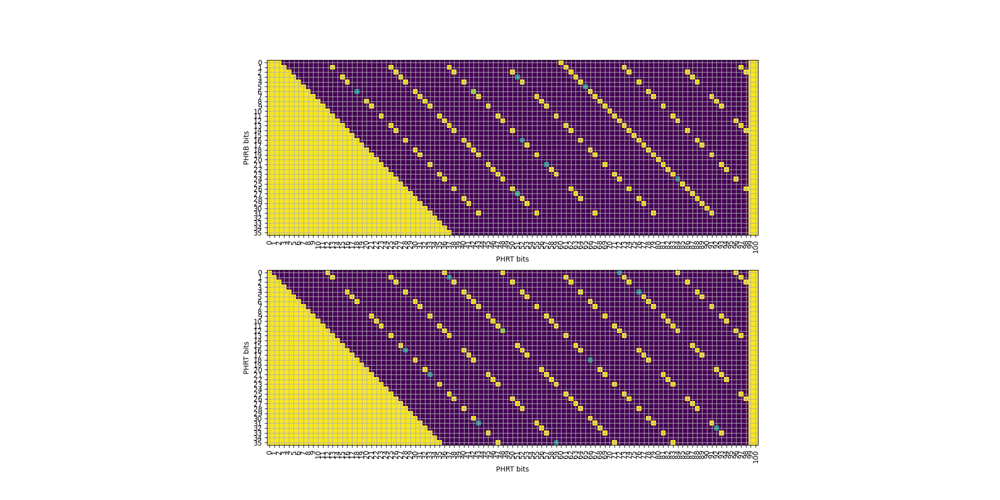
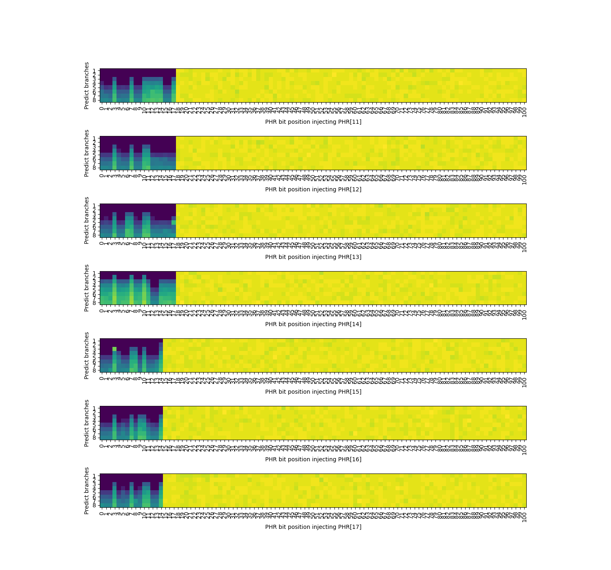
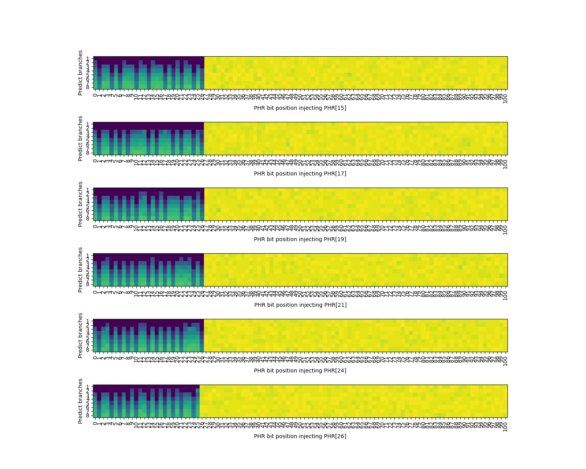
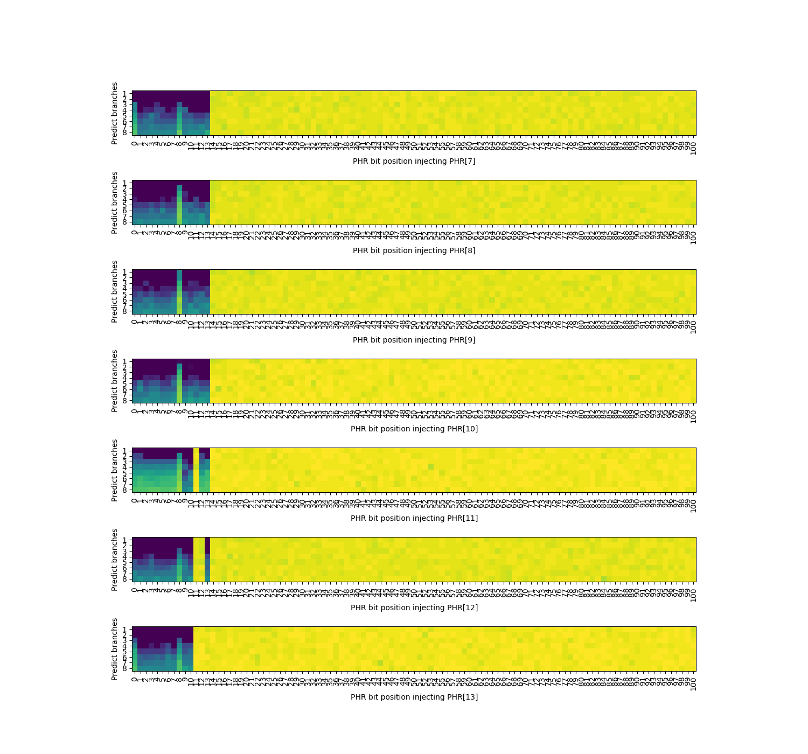

# Result of Dissecting Conditional Branch Predictors of Apple Firestorm and Qualcomm Oryon

Paper: https://arxiv.org/abs/2411.13900, cite as:

```bibtex
@misc{chen2024dissectingconditionalbranchpredictors,
      title={Dissecting Conditional Branch Predictors of Apple Firestorm and Qualcomm Oryon for Software Optimization and Architectural Analysis}, 
      author={Jiajie Chen and Peng Qu and Youhui Zhang},
      year={2024},
      eprint={2411.13900},
      archivePrefix={arXiv},
      primaryClass={cs.AR},
      url={https://arxiv.org/abs/2411.13900}, 
}
```

In this post, we reveal the detailed result of the experiments in the paper. The microbenchmarks used in this report are provided as-is in this repo.

## PHRB & PHRT

First, we show the result of probing PHRB & PHRT structure using phr_branch_bits_location and phr_target_bits_location microbenchmarks below:

### Apple Firestorm PHRB


### Qualcomm Oryon PHRB


### Apple Firestorm & Qualcomm Oryon PHRT


### Remark

In Apple's Patent [Managing table accesses for tagged geometric length (TAGE) load value prediction](https://patents.google.com/patent/US12159142B1/en):

```
Note that the branch history information used to access a non-base VTAGE table
may be updated based on each taken control transfer, e.g., based on the target
or based on the PC of the control transfer. As one specific example, the branch
history may be a path history that is an M+N bit value that is shifted left by
one and XOR'd with N bits of the fetch address of the current fetch group to
generate the next path history value each cycle, according to the following
example equation:

path_hist[M+N−1:0]={path_hist[M+N−2:0],1′b0}{circumflex over ( )}{M′b0,N_bits_of_PC}

As another example, branch history may be a global history that is an X+Y bit
value that is shifted left by one and XOR'd with Y bits of the fetch address of
the current fetch group to generate the next path history value each cycle,
according to the following example equation:

global_hist[X+Y−1:0]={global_hist[X+Y−2:0],1′b0}{circumflex over ( )}{X′b0,Y_bits_of_target}

In some embodiments, both global and path history may be used to access one or
more VTAGE tables or to access different VTAGE tables. Note that the Y bits of
the target may or may not be contiguous and may be located at different
positions within the address in different embodiments. In some embodiments, the
Y-bit portion of the current fetch address input to hash circuitry 310 is
different than the N-bit portion of the current fetch address input to hash
circuitry 305. In some embodiments, Y-bit portion includes one or more bits that
are more significant than any bits included in the N-bit portion. The N-bit and
Y-bit portions may or may not overlap. The number of bits implemented for M, N,
X, Y, etc. may affect the length of history used, control circuit area, the
impact of a given address on the current history value, etc. These parameters
may vary in different embodiments.
```

As of writing, we were unaware of this patent. It verifies our reverse engineered PHRB/PHRT construction: `path_hist` is PHRB, `global_hist` is PHRT. And the footprint of PHRT (Y-bit portion) is longer than that of PHRB (N-bit portion). Seems that Apple is also using the two PHR registers to predict load values.


## PHT Associativity

Then, we dissect the associativity of the TAGE table with the longest history using the pht_associativity microbenchmark:

### Apple Firestorm PHT Associativity

4-way with PC[6] and PC[9] in index:


### Qualcomm Oryon PHT Associativity

4-way with PC[6] and PC[7] in index (the data is a bit noisy, but enough to justify):


## PHT Tag Hash Function

Next, we dissect the tag hash function of the TAGE table with the longest history (the other tables share the same function) using the pht_tag_bits_xor_phr & pht_tag_bits_xor microbenchmarks:

### Apple Firestorm

Using pht_tag_bits_xor_phr to find xor relationship between PHR bits:


- PHRT[0,12,...,96] xor PHRB[8,21]
- PHRT[1,13,...,97] xor PHRB[9,22]
- PHRT[2,14,...,98] xor PHRB[10,23,24] 
- PHRT[3,15,...,87,99] xor PHRB[11,12,25]
- PHRT[4,16,...,88] xor PHRB[0,13,26]
- PHRT[5,17,...,89] xor PHRB[1,14,27]
- PHRT[6,18,...,90] xor PHRB[2,15]
- PHRT[7,19,...,91] xor PHRB[3,16]
- PHRT[8,20,...,92] xor PHRB[4,17]
- PHRT[9,21,...,93] xor PHRB[5,18]
- PHRT[10,22,...,94] xor PHRB[6,19]
- PHRT[11,23,...,95] xor PHRB[7,20]

Using pht_tag_bits_xor to find xor relationship between PHR bits and PC bits:


- PC[7] xor PHRT[0,12,...,96] xor PHRB[8,21]
- PC[8] xor PHRT[1,13,...,97] xor PHRB[9,22]
- PC[9] xor PHRT[2,14,...,98] xor PHRB[10,23,24]
- PC[10] xor PHRT[3,15,...,87,99] xor PHRB[11,12,25]
- PC[11] xor PHRT[4,16,...,88] xor PHRB[0,13,26]
- PC[12] xor PHRT[5,17,...,89] xor PHRB[1,14,27]
- PC[13] xor PHRT[6,18,...,90] xor PHRB[2,15]
- PC[14] xor PHRT[7,19,...,91] xor PHRB[3,16]
- PC[15] xor PHRT[8,20,...,92] xor PHRB[4,17]
- PC[16] xor PHRT[9,21,...,93] xor PHRB[5,18]
- PC[17] xor PHRT[10,22,...,94] xor PHRB[6,19]
- PC[18] xor PHRT[11,23,...,95] xor PHRB[7,20]
- PC[2:5]: individual bits

### Qualcomm Oryon

Using pht_tag_bits_xor_phr to find xor relationship between PHR bits:



- PHRT[0,12,...,96] xor PHRB[0,12,24]
- PHRT[1,13,...,97] xor PHRB[1,13,25]
- PHRT[2,14,...,98] xor PHRB[2,14,26] 
- PHRT[3,15,...,87,99] xor PHRB[3,15,27]
- PHRT[4,16,...,88] xor PHRB[4,16,28]
- PHRT[5,17,...,89] xor PHRB[5,17,29]
- PHRT[6,18,...,90] xor PHRB[6,18,30]
- PHRT[7,19,...,91] xor PHRB[7,19,31]
- PHRT[8,20,...,92] xor PHRB[8,20]
- PHRT[9,21,...,93] xor PHRB[9,21]
- PHRT[10,22,...,94] xor PHRB[10,22]
- PHRT[11,23,...,95] xor PHRB[11,23]

Using pht_tag_bits_xor to find xor relationship between PHR bits and PC bits:


- PC[8] xor PHRT[1,13,...,97] xor PHRB[1,13,25]
- PC[9] xor PHRT[2,14,...,98] xor PHRB[2,14,26] 
- PC[10] xor PHRT[3,15,...,87] xor PHRB[3,15,27]
- PC[11] xor PHRT[4,16,...,88] xor PHRB[4,16,28]
- PC[12] xor PHRT[5,17,...,89] xor PHRB[5,17,29]
- PHRT[6,18,...,90] xor PHRB[6,18,30]
- PHRT[7,19,...,91] xor PHRB[7,19,31]
- PHRT[8,20,...,92] xor PHRB[8,20]
- PHRT[9,21,...,93] xor PHRB[9,21]
- PHRT[10,22,...,94] xor PHRB[10,22]
- PHRT[11,23,...,95] xor PHRB[11,23]
- PHRT[0,12,...,96] xor PHRB[0,12,24]
- PC[2:5]: individual bits

## PHT Index Hash Functions

Last, we dissect the index hash function of the TAGE table with the longest history using the pht_index_bits_xor_phr & pht_index_bits_xor microbenchmarks:

### Apple Firestorm

#### TAGE table with the longest history (table #1)

Find xor relationship between PHRT and PHRT:


Find xor relationship between PHRT and PHRB:


Find xor relationship between PHRT and PC:


Final index hash function:

- PHRT[2] xor PHRT[43] xor PHRT[93]
- PHRT[7] xor PHRT[48] xor PHRT[99]
- PHRT[12] xor PHRT[63] xor PHRB[5]
- PHRT[17] xor PHRT[68] xor PHRB[10]
- PHRT[22] xor PHRT[73] xor PHRB[15]
- PHRT[27] xor PHRT[78] xor PHRB[20]
- PHRT[33] xor PHRT[83] xor PHRB[25]
- PHRT[38] xor PHRT[88] xor PC[9]
- PHRT[53] xor PHRT[58] xor PHRB[0]
- PC[6]

#### TAGE table with the 2nd longest history (table #2)

Find xor relationship between PHRT and PHRT:


Find xor relationship between PHRT and PHRB:


Find xor relationship between PHRT and PC:


Final index hash function:

- PHRT[1] xor PHRT[35] xor PHRB[10]
- PHRT[4] xor PHRT[38] xor PHRB[13]
- PHRT[8] xor PHRT[42] xor PHRB[17]
- PHRT[11] xor PHRT[45] xor PHRB[20]
- PHRT[14] xor PHRT[49] xor PHRB[23]
- PHRT[18] xor PHRT[52] xor PHRB[27]
- PHRT[21] xor PHRT[56] xor PHRB[0]
- PHRT[25] xor PHRT[28] xor PHRB[3]
- PHRT[32] xor PHRB[6] xor PC[9]
- PC[6]

#### TAGE table with the 3rd longest history (table #3)

Find xor relationship between PHRT and PHRT:


Find xor relationship between PHRT and PHRB:


Find xor relationship between PHRB and PHRB:


Find xor relationship between PHRT and PC:


Find xor relationship between PHRB and PC:


Final index hash function:

- PHRT[1] xor PHRT[26] xor PHRB[19]
- PHRT[3] xor PHRT[28] xor PHRB[0]
- PHRT[6] xor PHRT[31] xor PHRB[2]
- PHRT[8] xor PHRT[11] xor PHRB[4]
- PHRT[13] xor PHRB[7] xor PHRB[22]
- PHRT[16] xor PHRB[9] xor PHRB[24]
- PHRT[18] xor PHRB[12] xor PHRB[27]
- PHRT[21] xor PHRB[14] xor PC[8]
- PHRT[23] xor PHRB[17] xor PC[11]
- PC[6]

#### TAGE table with the 4th longest history (table #4)

Find xor relationship between PHRT and PHRT:


Find xor relationship between PHRT and PHRB:


Find xor relationship between PHRB and PHRT:


Find xor relationship between PHRB and PHRB:



Final index hash function:

- PHRT[0] xor PHRT[15] xor PHRB[2]
- PHRT[1] xor PHRT[17] xor PHRB[4]
- PHRT[3] xor PHRT[4] xor PHRB[5]
- PHRT[5] xor PHRB[6] xor PHRB[13]
- PHRT[7] xor PHRB[8] xor PHRB[15]
- PHRT[8] xor PHRB[9] xor PHRB[16]
- PHRT[10] xor PHRB[11] xor PHRB[17]
- PHRT[11] xor PHRB[12] xor PC[8]
- PHRT[12] xor PHRB[0] xor PC[9]
- PHRT[14] xor PHRB[1] xor PC[11]
- PC[6]

#### TAGE table with the 5th longest history (table #5)

Find xor relationship between PHRT and PHRT:


Find xor relationship between PHRT and PHRB:


Find xor relationship between PHRB and PHRT:


Find xor relationship between PHRB and PHRB:


Final index hash function:

- PHRT[0] xor PHRT[1] xor PHRB[5]
- PHRT[2] xor PHRB[6] xor PHRB[10]
- PHRT[3] xor PHRB[7] xor PC[7]
- PHRT[4] xor PHRB[8] xor PC[8]
- PHRT[5] xor PHRB[9] xor PC[9]
- PHRT[6] xor PHRB[0] xor PC[10]
- PHRT[7] xor PHRB[1] xor PC[11]
- PHRT[8] xor PHRB[2] xor PC[12]
- PHRT[9] xor PHRB[3] xor PC[13]
- PHRT[10] xor PHRB[4] xor PC[14]
- PC[6]

#### TAGE table with the 6th longest history (table #6)

The result is too noisy to guess the exact index hash function, but we think it has 11 index bits.

#### Summary

We give the following summary regarding the different TAGE tables:

| PHRT Length | PHRB Length | Assoc | Index Bits | Entry Count |
|-------------|-------------|-------|------------|-------------|
| 100         | 28          | 4     | 10         | 4K          |
| 57          | 28          | 4     | 10         | 4K          |
| 32          | 28          | 4     | 10         | 4K          |
| 18          | 18          | 4     | 11         | 8K          |
| 11          | 11          | 6     | 11         | 12K         |
| 6           | 6           | 6     | 11*        | 12K*        |

*: Low confidence

### Qualcomm Oryon

#### TAGE table with the longest history (table #1)

Find xor relationship between PHRT and PHRT:


Find xor relationship between PHRT and PHRB:


Find xor relationship between PHRT and PC:


Final index hash function:

- PHRT[3] xor PHRT[44] xor PHRT[95]
- PHRT[8] xor PHRT[49] xor PC[7]
- PHRT[14] xor PHRT[65] xor PHRB[5]
- PHRT[19] xor PHRT[70] xor PHRB[10]
- PHRT[24] xor PHRT[75] xor PHRB[15]
- PHRT[29] xor PHRT[80] xor PHRB[20]
- PHRT[34] xor PHRT[85] xor PHRB[25]
- PHRT[39] xor PHRT[90] xor PHRB[30]
- PHRT[54] xor PHRT[60] xor PHRB[0]
- PC[6]

#### TAGE table with the 2nd longest history (table #2)

Find xor relationship between PHRT and PHRT:


Find xor relationship between PHRT and PHRB:


Find xor relationship between PHRT and PC:


Final index hash function:

- PHRT[1] xor PHRT[38] xor PHRB[6]
- PHRT[4] xor PHRT[41] xor PHRB[10]
- PHRT[8] xor PHRT[44] xor PHRB[13]
- PHRT[11] xor PHRT[48] xor PHRB[16]
- PHRT[14] xor PHRT[51] xor PHRB[20]
- PHRT[18] xor PHRB[23] xor PC[9]
- PHRT[21] xor PHRT[28] xor PHRB[26]
- PHRT[24] xor PHRT[31] xor PHRB[0]
- PHRT[34] xor PHRB[3] xor PHRB[30]
- PC[6]

#### TAGE table with the 3rd longest history (table #3)

Find xor relationship between PHRT and PHRT:



Find xor relationship between PHRT and PHRB:


Find xor relationship between PHRB and PHRT:


Find xor relationship between PHRB and PHRB:


Find xor relationship between PHRT and PC[8]:


Find xor relationship between PHRT and PC[10]:


Final index hash function:

- PHRT[1] xor PHRB[11] xor PC[8]
- PHRT[4] xor PHRB[13] xor PC[10]
- PHRT[6] xor PHRB[15] xor PHRB[13]
- PHRT[8] xor PHRT[15] xor PHRB[17]
- PHRT[10] xor PHRT[17] xor PHRB[0]
- PHRT[19] xor PHRB[2] xor PHRB[20]
- PHRT[21] xor PHRB[4] xor PHRB[22]
- PHRT[24] xor PHRB[6] xor PHRB[24]
- PHRT[26] xor PHRB[8] xor PHRB[26]
- PC[6]

#### TAGE table with the 4th longest history (table #4)

Find xor relationship between PHRT and PHRT:


Find xor relationship between PHRT and PHRB:



Find xor relationship between PHRB and PHRT:


Find xor relationship between PHRB and PHRB:


Final index hash function:

- PHRT[0] xor PHRB[4] xor PC[10]
- PHRT[1] xor PHRB[5] xor PC[11]
- PHRT[3] xor PHRT[8] xor PHRB[6]
- PHRT[4] xor PHRT[9] xor PHRB[7]
- PHRT[5] xor PHRT[10] xor PHRB[9]
- PHRT[6] xor PHRT[12] xor PHRB[10]
- PHRT[7] xor PHRT[13] xor PHRB[0]
- PHRB[1] xor PHRB[11] xor PC[7]
- PHRB[2] xor PHRB[12] xor PC[8]
- PHRB[3] xor PHRB[13] xor PC[9]
- PC[6]

#### TAGE table with the 5th longest history (table #5)

The result is too noisy to guess the exact index hash function, but we think it has 11 index bits.

#### TAGE table with the 6th longest history (table #6)

The result is too noisy to guess the exact index hash function, but we think it has 11 index bits.

#### Summary

We give the following summary regarding the different TAGE tables:

| PHRT Length | PHRB Length | Assoc | Index Bits | Entry Count |
|-------------|-------------|-------|------------|-------------|
| 100         | 32          | 4     | 10         | 4K          |
| 52          | 32          | 4     | 10         | 4K          |
| 27          | 27          | 4     | 10         | 4K          |
| 14          | 14          | 4     | 11         | 8K          |
| 7           | 7           | 4     | 11*        | 8K*         |
| 4           | 4           | 6     | 11*        | 12K*        |

*: Low confidence
